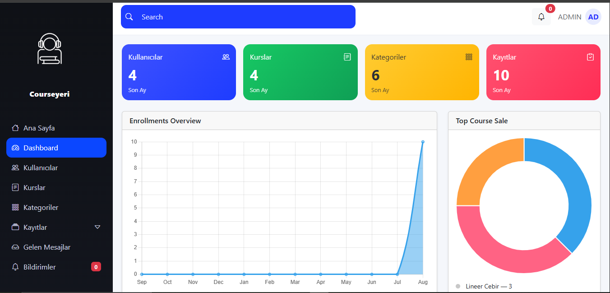

# CourseYeri – Staj Projesi 2025

## 📌 Projenin Amacı
Bu proje, kullanıcıların kurslara kayıt olabildiği, ödeme yapabildiği ve yöneticilerin tüm sistemi yönetebildiği bir eğitim platformudur.

## 🛠 Kullanılan Teknolojiler
- ASP.NET Core MVC (.NET 8)
- Entity Framework Core (Code First)
- MS SQL Server
- Chart.js
- DataTables, SweetAlert2
- HTML, CSS, Bootstrap, jQuery

## 👤 Kullanıcı Rolleri
- **Admin:** Kurs, kategori, kullanıcı, ödeme ve bildirim yönetimi yapar.
- **Kullanıcı:** Kurslara kayıt olur, ödemelerini takip eder, bildirim ve e-posta alır.

## 🔑 Giriş Bilgileri (örnek)
- **Admin:** admin / 123456  
- **User:** user1 / 123456  

## 📷 Ekran Görüntüleri

### Admin Giriş Sayfası


### Admin Dashboard


### Kullanıcı Giriş Sayfası


### Kullanıcılar Yönetim Sayfası


### Kullanıcı Paneli


## 📦 Kurulum
1. Repo’yu indirin veya klonlayın:
   ```bash
   git clone https://github.com/ShamsALHAJJI44/CorseYeri.git
